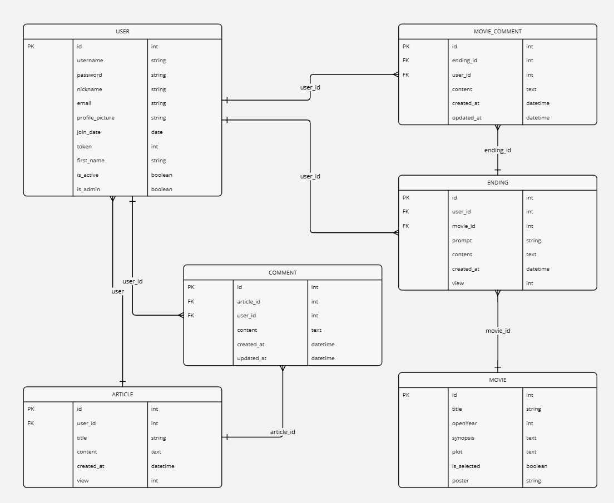

# 비틀러(Bittler)

SSAFY 12기 관통 프로젝트입니다.  
ChatGPT를 활용하여 추천 영화의 대체 결말을 생성하고, 사용자 간 소통이 가능한 커뮤니티를 제공합니다.
## 스택별 README로 이동
---
### [BackEnd](./back/README.md)
### [FrontEnd](./front/README.md)
---
# 목차 (Index)

0. Commit 규칙
1. 프로젝트 구조
2. 팀원 정보 및 업무 분담  
3. 목표 서비스 구현 및 실제 구현 정도  
4. 데이터베이스 모델링 (ERD)  
5. 대체 결말 생성 알고리즘  
6. 핵심 기능 설명  
7. 생성형 AI 활용  
8. 프로젝트 후기 및 느낀 점  
9. 배포 서버 URL
---
## 0. Commit 규칙

> **Commit 메시지는 아래 규칙을 따릅니다.**  
> 형식: `type: body / Issue`

### 1) Commit 메시지 예시
- `feat: navbar 추가 / Closes #3`
- `fix: 로그인 오류 해결 / Fixes #10`

### 2) Type 키워드
| Type     | 설명                   |
| -------- | -------------------- |
| feat     | 새로운 기능 추가            |
| fix      | 버그 수정                |
| docs     | 문서 수정                |
| style    | 코드 스타일 변경 (기능 변경 없음) |
| refactor | 코드 리팩토링              |
| build    | 빌드 파일 수정             |
| perf     | 성능 개선                |

### 3) Issue 키워드
| 키워드    | 설명                     |
| ------ | ---------------------- |
| Closes | 이슈 종료 (예: `Closes #1`) |
| Fixes  | 이슈 수정 (예: `Fixes #2`)  |
| Ref    | 참고용 이슈 (예: `Ref #3`)   |

---
## 1. 프로젝트 구조
---
AltEnds
├─ .gitignore                # Git에서 추적하지 않을 파일들을 명시하는 파일
├─ back                      # 백엔드 관련 파일들을 모은 디렉토리
│  ├─ accounts               # 사용자 계정 관련 기능
│  │  ├─ adapter.py          # 사용자 인증에 필요한 어댑터
│  │  ├─ admin.py            # 관리자 페이지에서 사용할 모델 등록
│  │  ├─ apps.py             # 앱의 설정 파일
│  │  ├─ exception_handlers.py # 예외 처리 관련 파일
│  │  ├─ forms.py            # 사용자 폼 관련 파일
│  │  ├─ migrations          # 데이터베이스 마이그레이션 관련 파일들
│  │  ├─ models.py           # 사용자 관련 데이터 모델
│  │  ├─ serializers.py      # 직렬화(Serialization) 관련 파일
│  │  ├─ signals.py          # 시그널 관련 파일
│  │  ├─ tests.py            # 사용자 관련 테스트 파일
│  │  ├─ views.py            # 사용자 관련 뷰(View) 파일
│  │  └─ __init__.py         # 패키지 초기화 파일
│  ├─ back                   # 백엔드의 기본 설정 및 구동 파일
│  │  ├─ asgi.py             # ASGI 설정 파일
│  │  ├─ settings.py         # Django 프로젝트의 설정 파일
│  │  ├─ urls.py             # URL 라우팅 설정 파일
│  │  ├─ wsgi.py             # WSGI 설정 파일
│  │  └─ __init__.py         # 패키지 초기화 파일
│  ├─ communityarticles      # 커뮤니티 게시글 관련 기능
│  │  ├─ admin.py            # 관리자 페이지에서 사용할 모델 등록
│  │  ├─ apps.py             # 앱의 설정 파일
│  │  ├─ migrations          # 데이터베이스 마이그레이션 관련 파일들
│  │  ├─ models.py           # 커뮤니티 관련 데이터 모델
│  │  ├─ serializers.py      # 직렬화(Serialization) 관련 파일
│  │  ├─ tests.py            # 커뮤니티 관련 테스트 파일
│  │  ├─ urls.py             # URL 라우팅 설정 파일
│  │  ├─ views.py            # 커뮤니티 관련 뷰(View) 파일
│  │  └─ __init__.py         # 패키지 초기화 파일
│  ├─ manage.py              # Django 프로젝트 관리 명령어 실행 파일
│  ├─ media                  # 미디어 파일 저장 폴더 (영화 이미지, 프로필 사진 등)
│  │  ├─ movies              # 영화 관련 미디어 파일들
│  │  ├─ profilepictures     # 사용자 프로필 사진 저장 폴더
│  │  └─ static              # 정적 파일들 (CSS, JavaScript 등)
│  ├─ moviearticles          # 영화 게시글 관련 기능
│  │  ├─ admin.py            # 관리자 페이지에서 사용할 모델 등록
│  │  ├─ apps.py             # 앱의 설정 파일
│  │  ├─ fixtures            # 초기 데이터 파일들 (예: 영화 데이터)
│  │  │  └─ movie.json       # 영화 데이터 초기화 파일
│  │  ├─ migrations          # 데이터베이스 마이그레이션 관련 파일들
│  │  ├─ models.py           # 영화 관련 데이터 모델
│  │  ├─ serializers.py      # 직렬화(Serialization) 관련 파일
│  │  ├─ tests.py            # 영화 관련 테스트 파일
│  │  ├─ urls.py             # URL 라우팅 설정 파일
│  │  ├─ views.py            # 영화 관련 뷰(View) 파일
│  │  └─ __init__.py         # 패키지 초기화 파일
│  ├─ README.md              # 프로젝트 설명 파일
│  └─ requirements.txt       # 프로젝트에 필요한 외부 라이브러리 목록
├─ ERD.jpg                   # 데이터베이스 ERD 다이어그램
├─ front                     # 프론트엔드 관련 파일들을 모은 디렉토리
│  ├─ .gitignore             # Git에서 추적하지 않을 파일들을 명시하는 파일
│  ├─ assets                 # 정적 자산(폰트, 이미지 등) 폴더
│  │  └─ fonts               # 폰트 파일들
│  ├─ index.html             # 웹 애플리케이션의 HTML 진입점
│  ├─ jsconfig.json          # JavaScript 프로젝트 설정 파일
│  ├─ package-lock.json      # NPM 의존성 잠금 파일
│  ├─ package.json           # 프로젝트 의존성 및 스크립트 설정 파일
│  ├─ public                 # 공개할 파일들 (예: favicon)
│  │  └─ favicon.ico         # 사이트의 파비콘
│  ├─ README.md              # 프론트엔드 프로젝트 설명 파일
│  ├─ src                    # 소스 코드 파일들
│  │  ├─ App.vue             # Vue 애플리케이션의 루트 컴포넌트
│  │  ├─ components          # Vue 컴포넌트들
│  │  │  ├─ Comments.vue     # 댓글 컴포넌트
│  │  │  ├─ EndingRanking.vue # 대체 결말 랭킹 컴포넌트
│  │  │  ├─ EndingTwistButton.vue # 결말 변경 버튼 컴포넌트
│  │  │  ├─ Like.vue         # 좋아요 버튼 컴포넌트
│  │  │  ├─ Modal.vue        # 모달 컴포넌트
│  │  │  ├─ MovieDetailModal.vue # 영화 상세 모달 컴포넌트
│  │  │  ├─ NavBar.vue       # 네비게이션 바 컴포넌트
│  │  │  ├─ Sample.vue       # 샘플 컴포넌트 (예시용)
│  │  │  ├─ SelectModal.vue  # 선택 모달 컴포넌트
│  │  │  ├─ UserRanking.vue  # 사용자 랭킹 컴포넌트
│  │  │  └─ WeeklyMovies.vue # 주간 영화 리스트 컴포넌트
│  │  ├─ main.js             # 애플리케이션 진입점 (Vue 인스턴스 생성)
│  │  ├─ router              # 라우터 관련 설정 파일들
│  │  │  └─ index.js         # Vue Router 설정 파일
│  │  ├─ stores               # Vuex 스토어 관련 파일들
│  │  │  └─ counter.js        # 상태 관리 파일 (카운터 예시)
│  │  └─ views               # Vue 뷰 컴포넌트들
│  │     ├─ AdminMovieCreateView.vue  # 영화 관리 페이지 (영화 생성)
│  │     ├─ AdminMovieSelectView.vue # 영화 선택 페이지
│  │     ├─ CommunityCreateView.vue  # 커뮤니티 게시글 작성 페이지
│  │     ├─ CommunityDetailView.vue  # 커뮤니티 게시글 상세 보기
│  │     ├─ CommunityUpdateView.vue  # 커뮤니티 게시글 수정 페이지
│  │     ├─ CommunityView.vue        # 커뮤니티 게시글 목록 페이지
│  │     ├─ EndingListCreateView.vue # 대체 결말 작성 페이지
│  │     ├─ EndingListDetailView.vue # 대체 결말 상세 보기
│  │     ├─ EndingListView.vue       # 대체 결말 목록 보기
│  │     ├─ HomeView.vue             # 메인 페이지
│  │     ├─ LoginView.vue            # 로그인 페이지
│  │     ├─ MovieListSelectView.vue  # 영화 선택 페이지
│  │     ├─ MovieListView.vue        # 영화 목록 보기
│  │     ├─ PrevLoginView.vue        # 이전 로그인 페이지 (백업용)
│  │     ├─ ProfileChangeView.vue    # 프로필 변경 페이지
│  │     ├─ ProfileView.vue          # 프로필 보기 페이지
│  │     └─ SignUpView.vue           # 회원가입 페이지
│  └─ vite.config.js            # Vite 설정 파일
└─ README.md                  # 프로젝트 설명 파일

---

## 2. 팀원 정보 및 업무 분담

### 1) 팀원 정보
- **팀장**: 윤상흠  
- **팀원**: 민경현  

### 2) 업무 분담
#### 1. 프론트엔드
- **민경현**: Vue.js 기반 전체적인 프론트엔드 및 디자인 구현  
- **윤상흠**: UI/UX 설계, 네비게이션 및 라우터 설정  

#### 2. 백엔드
- **민경현**: 데이터 모델링, 주요 API 설계 및 백엔드 로직 구현  
- **윤상흠**: API 연동, 로직 디버깅 및 성능 최적화  

#### 3. 스타일링
- **민경현**: 스타일링 리더로서 전체 디자인 통일성 유지  
- **윤상흠**: 특정 페이지의 스타일 최적화  

#### 4. 문서화
- **윤상흠**: README 및 사용 가이드 문서 작성  

---

## 3. 목표 서비스 구현 및 실제 구현 정도

### 1) 목표 서비스
- ChatGPT 기반 대체 결말 생성  
- 대체 결말 게시판 및 커뮤니티 기능  
- 관리자 전용 영화 데이터 관리 페이지  

### 2) 구현 정도
- 목표 서비스 기능 100% 구현 완료  

---

## 4. 데이터베이스 모델링 (ERD)
- ERD 다이어그램:

---

## 5. 대체 결말 생성 알고리즘

- **프로세스**:  
  1. TMDB API로 영화 데이터를 수집  
  2. 사용자 입력 및 영화 데이터를 기반으로 ChatGPT API 요청  
  3. 생성된 대체 결말을 데이터베이스에 저장  
  4. 사용자 피드백 (좋아요/댓글) 반영  

---

## 6. 핵심 기능 설명

### 1) 메인 페이지 (HomeView)
- **구성 요소**:  
  - **네비게이션 바**: 아래의 목록이 페이지 상단에 표시.
	  - 홈
	  - 대체 결말 페이지
	  - 커뮤니티 페이지
	  - 영화 리스트 페이지
	  - 로그인/로그아웃, 회원가입, 마이페이지
  - **주간 영화 목록**: TMDB API를 기반으로 선정된 인기 영화 표시.  
  - **대체 결말 랭킹**: 좋아요 수를 기준으로 상위 대체 결말 표시.  
  - **사용자 랭킹**: 대체 결말 작성 및 활동 점수에 따라 순위 표시.  

### 2) 유저관리 페이지
- **로그인 페이지 (LoginView)**  
  - 아이디와 비밀번호 입력, 로그인 실패 시 에러 메시지 표시.  
  - 회원가입 페이지로 이동 가능한 버튼 제공.  
- **회원가입 페이지 (SignUpView)**  
  - 아이디, 비밀번호, 닉네임, 이메일 입력 및 비밀번호 확인, 실패 시 에러 메시지 표시.
- **마이페이지 (ProfileView)**  
  - 유저 프로필 사진, 닉네임, 잔여 토큰, 가입 날짜 표시.  
  - 개인정보 변경 버튼 제공.
- **유저 정보 변경 페이지 (ProfileChangeView)**  
  - 유저 프로필 사진, 닉네임을 변경.

### 3) 영화 데이터 페이지 (MovieListView & MovieListDetailView)
- **영화 리스트 (MovieListView)**  
  - TMDB API에서 가져온 영화 데이터를 기반으로 영화 리스트를 제공.  
  - 각 영화는 제목, 포스터 이미지의 기본 정보를 포함.  
  - 영화 항목을 클릭하면 해당 영화의 상세 정보 페이지로 이동.  

- **영화 상세 정보 (MovieListDetailView)**  
  - 선택한 영화의 세부 정보 표시: 제목, 줄거리 포함.  
  - 대체 결말 생성 버튼 제공: 사용자가 기존 결말을 비틀어 새로운 결말을 작성할 수 있도록 유도.
  - 대체 결말 생성 후, 작성 페이지로 자동 이동하여 사용자가 편리하게 작업 가능.  

### 4) 대체 결말 페이지
- **대체 결말 게시판 페이지 (EndingListView)**  
  - 작성된 대체 결말 목록을 인기순/최신순으로 정렬 가능.  
  - 각 게시글에 좋아요 및 댓글 기능 제공.  
- **대체 결말 작성 페이지 (EndingListCreateView)**  
  - 선택한 영화의 기존 결말에 대해 새로운 대체 결말 작성 기능 제공.  
  - 작성된 프롬프트에 따른 결말에 대해 프롬프트 재입력 기능 제공.
- **대체 결말 상세 정보 페이지 (EndingListDetailView)**  
  - 작성된 대체 결말의 세부 정보와 함께 댓글 및 좋아요 기능 제공.

### 5) 커뮤니티 페이지
- **커뮤니티 게시판 페이지 (CommunityView)**  
  - 사용자들이 자유롭게 작성한 게시글 목록 표시.  
  - 게시글을 인기순/최신순으로 정렬 가능.  
- **커뮤니티 게시글 작성 페이지 (CommunityCreateView)**  
  - 자유로운 주제의 게시글 작성 가능.  
- **커뮤니티 게시글 상세 페이지 (CommunityDetailView)**  
  - 게시글 세부 정보 표시, 댓글 및 좋아요 기능 제공.  

### 6) 관리자 페이지 (MovieListCreateView)
- **구성 요소**:  
  - 관리자 권한 사용자만 접근 가능.  
  - TMDB API를 활용해 새로운 영화 데이터를 추가.  
  - 추가된 영화는 영화 리스트 및 상세 페이지에서 확인 가능.  

---

## 7. 생성형 AI 활용

- **사용 기술**:  
  - OpenAI의 ChatGPT API를 통해 영화의 대체 결말 생성  
- **특징**:  
  - 사용자 선택에 기반한 영화 결말 창작  
  - 간단한 입력값으로 높은 품질의 결과 제공  

---

## 8. 프로젝트 후기 및 느낀 점

### 1) 초반 설계의 중요성
- Skeleton 설계를 통해 작업의 효율성을 극대화할 수 있었습니다.  

### 2) 협업 및 소통의 중요성
- 문제 발생 시 빠른 소통과 유기적인 업무 조정의 중요성을 깨달았습니다.  

### 3) 규칙성과 통일성의 필요성
- RESTful API 설계와 URL 규칙 통일을 통해 개발 속도를 개선할 수 있었습니다.  

---

## 9. 배포 서버 URL
- 배포 URL: 준비 중